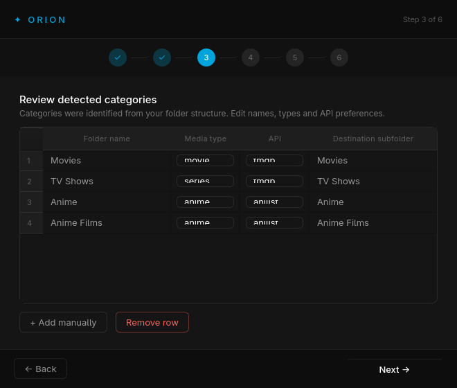
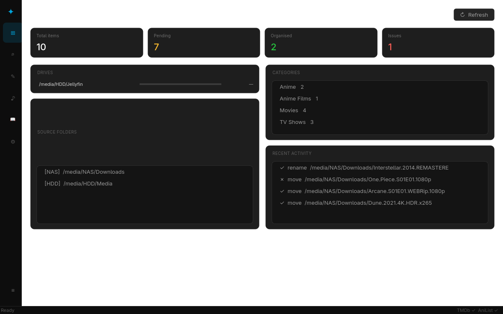
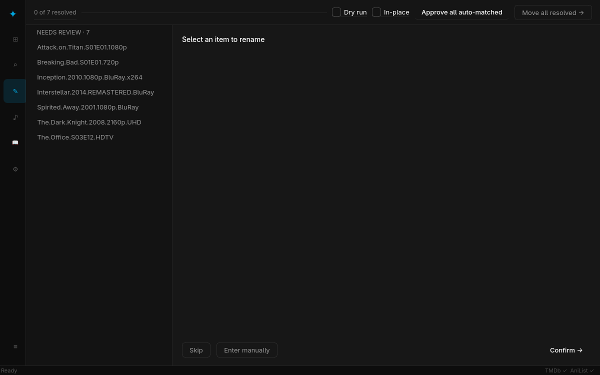
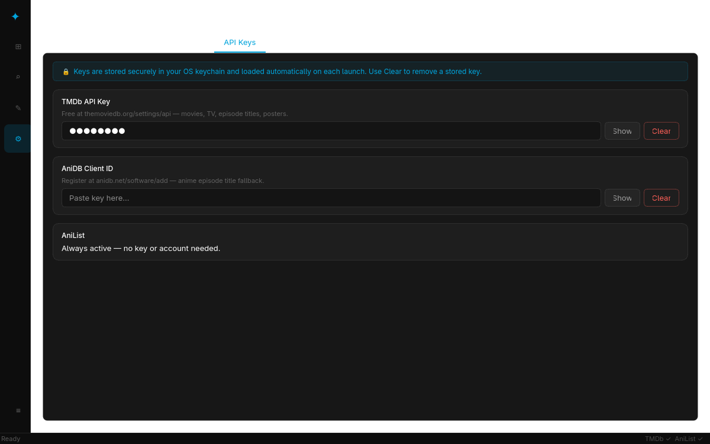
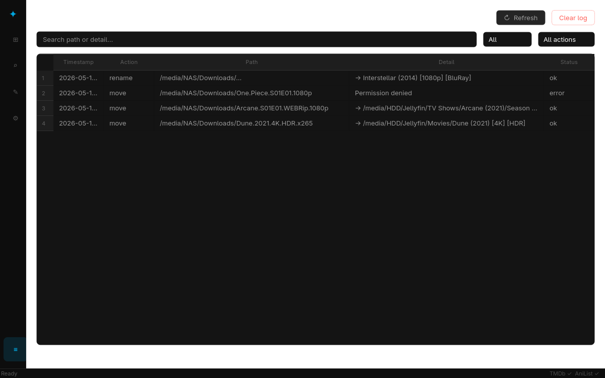

<div align="center">
  

  # Orion

  **A Jellyfin-native media library organizer**

  Scan, rename, and move your media collection with API-powered metadata lookups — all in a single desktop app.

  [](LICENSE)
  [](https://python.org)
  [](https://pypi.org/project/PyQt6/)
  []()

</div>

---

## Screenshots

<table>
  <tr>
    <td align="center"><b>Setup wizard — Welcome</b></td>
    <td align="center"><b>Setup wizard — Categories</b></td>
  </tr>
  <tr>
    <td></td>
    <td></td>
  </tr>
  <tr>
    <td align="center"><b>Dashboard</b></td>
    <td align="center"><b>Rename panel</b></td>
  </tr>
  <tr>
    <td></td>
    <td></td>
  </tr>
  <tr>
    <td align="center"><b>Settings — API Keys (OS keychain)</b></td>
    <td align="center"><b>Activity log</b></td>
  </tr>
  <tr>
    <td></td>
    <td></td>
  </tr>
</table>

---

## What it does

Orion turns a messy media folder into the exact structure Jellyfin expects:

```
Movies/
  Inception (2010)/
    Inception (2010) [1080p] [BluRay].mkv

TV Shows/
  Breaking Bad (2008)/
    Season 01/
      Breaking Bad (2008) - S01E01 - Pilot.mkv

Anime/
  Attack on Titan (2013)/
    Season 01/
      Attack on Titan (2013) - S01E01 - To You, in 2000 Years.mkv
```

It handles the full pipeline: **scan → identify → rename → move**, with poster previews and quality-tag control along the way.

---

## Features

- **Guided first-launch wizard** — sources, categories, destinations, and API keys in one flow
- **Auto category detection** — infers movie / series / anime from folder names and structure
- **API-powered renaming** — searches TMDb (movies & TV) and AniList / AniDB (anime); poster thumbnails shown inline
- **Quality tag control** — choose which tags (`[1080p]`, `[HDR]`, `[BluRay]`…) to keep per file
- **Episode naming** — configurable `S{s:02d}E{e:02d}` pattern with episode titles fetched from API
- **Same-drive fast moves** — uses `os.rename` (instant) when source and destination share a drive; falls back to `shutil.move` across drives
- **Session-only API keys** — keys live in memory only, never written to disk
- **System tray** — minimizes to tray, shows progress notifications on completion
- **Activity log** — full history of every rename and move
- **Cross-platform** — Windows, macOS, and Linux

---

## Requirements

| Dependency | Min version | Purpose |
|---|---|---|
| Python | 3.11 | Runtime |
| PyQt6 | 6.7.0 | Desktop GUI |
| requests | 2.32.0 | API HTTP calls |
| guessit | 3.8.0 | Filename parsing |
| Pillow | 10.3.0 | Image handling |
| keyring | 25.0.0 | OS keychain storage for API keys |

---

## Installation

### From source (all platforms)

```bash
git clone https://github.com/Varun-SV/Orion.git
cd Orion
pip install -r requirements.txt
python main.py
```

### Standalone executable (Windows)

```bash
pip install pyinstaller
pyinstaller build.spec
# Output → dist/Orion/Orion.exe
```

---

## First launch

A setup wizard runs automatically the first time you open Orion:

| Step | What you do |
|---|---|
| 1 — Welcome | Read the intro, click **Get Started** |
| 2 — Sources | Browse to your unorganized media folders; Orion pre-scans and suggests categories |
| 3 — Categories | Review detected categories — adjust names, media types, API preference, and destination subfolders |
| 4 — Destinations | Pick the root folder(s) where organized media will land |
| 5 — API keys | Paste your TMDb key and/or AniDB client ID (optional) |
| 6 — Done | Open the dashboard |

---

## API keys

| Service | Key required? | How to get one |
|---|---|---|
| **TMDb** | Recommended | [themoviedb.org/settings/api](https://www.themoviedb.org/settings/api) — free account |
| **AniList** | No | Always active, no key needed |
| **AniDB** | Optional | Register a client at [anidb.net/software/add](https://anidb.net/software/add) — used as episode-title fallback |

Keys are stored in the **OS keychain** and loaded automatically on every launch — you only need to enter them once:

| OS | Backend |
|---|---|
| Windows | Windows Credential Manager |
| macOS | Keychain Services |
| Linux | Secret Service API (GNOME Keyring, KDE Wallet) |

Use **Settings → API Keys → Clear** to remove a stored key. If no keyring backend is available (e.g. a headless Linux server), Orion falls back to session-only storage and displays a warning banner.

---

## Usage walkthrough

### 1. Scan

Open the **Scan** panel and click **Scan now**. Orion walks your source folders, matches them to configured categories, and populates the item list. You can stop a running scan at any time.

### 2. Rename

Switch to the **Rename** panel. For each item:

1. Orion fetches API candidates automatically (TMDb / AniList based on the category's API preference).
2. Pick the correct match from the list — poster thumbnails help confirm the right title.
3. For video files, choose which quality tags to keep.
4. Confirm. Choices are remembered for the session so re-processing is instant.

### 3. Move

Once rename choices are confirmed, click **Move selected** (or **Move all**). Orion:

- Builds the destination path from your category's configured subfolder
- Prefers same-drive destinations for instant moves
- Logs every action to the activity log
- Updates the item status to `organised` on success or `error` on failure

### Dashboard

The dashboard gives you a live overview: total items, pending count, organised count, issues, drive usage bars, source folders, categories, and recent activity.

---

## Configuration & data storage

Orion stores all state in a single directory:

| OS | Location |
|---|---|
| Windows | `%APPDATA%\Orion\` |
| macOS / Linux | `~/Orion/` |

| File | Contents |
|---|---|
| `organizer.db` | SQLite database — sources, categories, scan items, rename choices, activity log |
| `prefs.json` | UI preferences — window geometry, last active panel |

> **First launch detection**: Orion checks whether `organizer.db` exists. Deleting this file resets the app to first-launch state (the wizard re-runs). Your media files are never touched by a reset.

---

## Jellyfin naming conventions

Orion formats names to match Jellyfin's scanner expectations:

| Media type | Folder format | File format |
|---|---|---|
| Movie | `Title (Year)/` | `Title (Year) [tags].ext` |
| TV series | `Series (Year)/Season NN/` | `Series (Year) - SXXEXX - Episode Title.ext` |
| Anime | `Series (Year)/Season NN/` | `Series (Year) - SXXEXX - Episode Title.ext` |

Quality tags (e.g. `[1080p]`, `[HDR10]`) are optional bracket suffixes you control per file in the Rename panel.

---

## Project structure

```
Orion/
├── main.py                  # Entry point — initializes app, DB, wizard or main window
├── core/
│   ├── config.py            # App config, prefs, session-only API key store
│   ├── database.py          # SQLite schema and all query helpers
│   ├── scanner.py           # Source folder walking + category detection heuristics
│   ├── renamer.py           # API candidate fetch + rename choice persistence
│   ├── file_namer.py        # Jellyfin filename formatting + quality tag extraction
│   ├── mover.py             # File/folder move (same-drive vs cross-drive)
│   └── utils.py             # Filename sanitization, video/subtitle extension sets, drive info
├── api/
│   ├── tmdb.py              # TMDb REST client — movies, TV shows, posters, episode titles
│   ├── anilist.py           # AniList GraphQL client — anime search
│   └── anidb.py             # AniDB HTTP client — anime episode title fallback
├── ui/
│   ├── main_window.py       # Sidebar navigation + stacked panels + system tray
│   ├── wizard.py            # First-launch setup wizard (6 steps)
│   ├── dashboard.py         # Stats cards, drive bars, sources, categories, activity
│   ├── scan_panel.py        # Scan controls + item list
│   ├── rename_panel.py      # API search, candidate picker, tag selector
│   ├── settings_panel.py    # Edit sources, categories, destinations post-setup
│   ├── log_panel.py         # Activity log viewer
│   └── styles.py            # Dark Jellyfin-inspired QSS theme
├── workers/
│   ├── scan_worker.py       # QThread: runs Scanner without blocking the UI
│   ├── api_worker.py        # QThread: API lookups with progress signals
│   └── move_worker.py       # QThread: file moves with per-item progress
├── build.spec               # PyInstaller build configuration
├── requirements.txt
└── LICENSE
```

---

## Known limitations (beta)

- **AniDB requires client registration** — unregistered clients are aggressively rate-limited. Register at [anidb.net/software/add](https://anidb.net/software/add) and enter your client ID on the API keys screen.
- **Linux without a keyring daemon** — headless or minimal Linux installs may have no Secret Service provider. Install GNOME Keyring (`gnome-keyring`) or KWallet and ensure a D-Bus session is running; without one, keys fall back to session-only.
- **No undo** — moves are immediate; verify your destination path in Settings before running.
- **Same-drive detection is drive-letter based** — on Linux/macOS all paths share an empty drive string, so same-drive fast-path is always taken.

---

## Contributing

Pull requests are welcome. For significant changes please open an issue first to discuss what you'd like to change.

---

## License

[MIT](LICENSE) — Copyright © 2026 Varun S V
