<div align="center">
  

  # Orion

  **A Jellyfin-native media library organizer**

  Scan, rename, and move your entire media collection — videos, music, and books — with API-powered metadata lookups, NFO + artwork sidecars, and live Jellyfin/Emby server integration, all in a single desktop app.

  [](LICENSE)
  [](https://python.org)
  [](https://pypi.org/project/PyQt6/)
  []()

</div>

---

## Screenshots

### Setup

<table>
  <tr>
    <td align="center"><b>Welcome wizard</b></td>
    <td align="center"><b>Category detection</b></td>
  </tr>
  <tr>
    <td>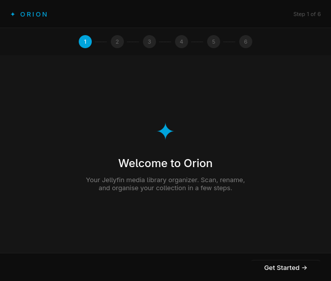</td>
    <td>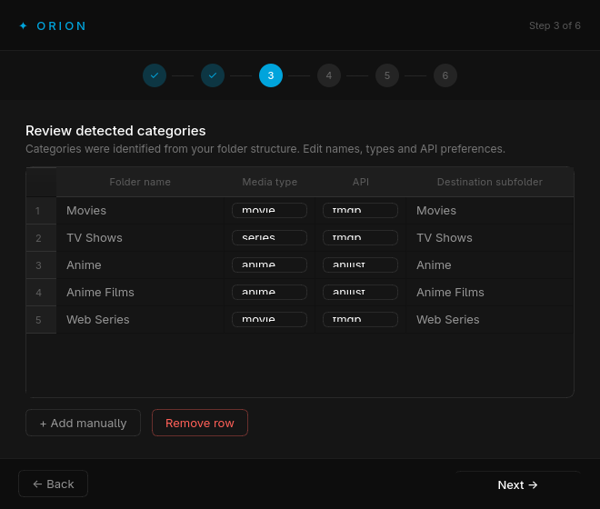</td>
  </tr>
</table>

### Video panels

<table>
  <tr>
    <td align="center"><b>Dashboard</b></td>
    <td align="center"><b>Movies</b></td>
  </tr>
  <tr>
    <td>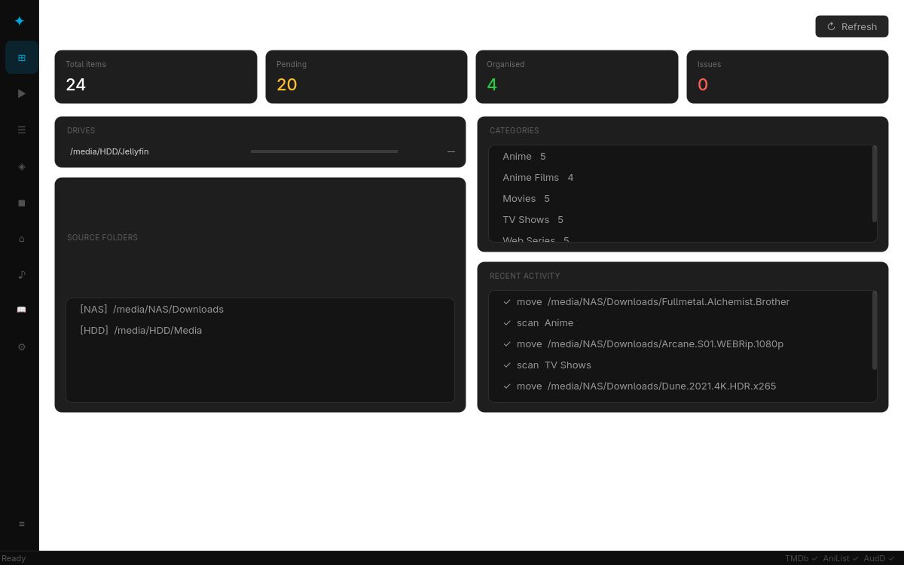</td>
    <td>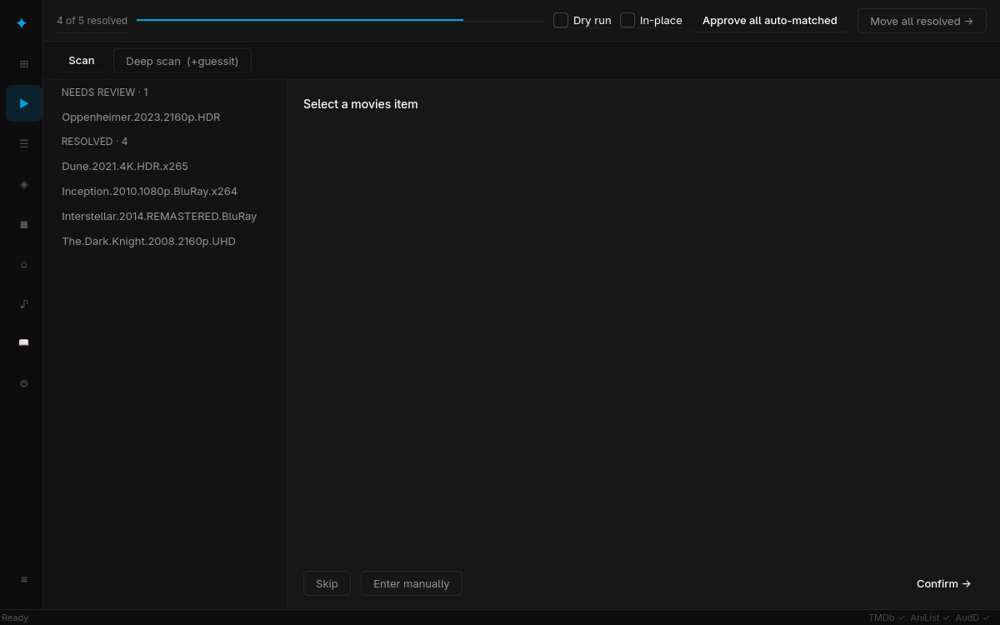</td>
  </tr>
  <tr>
    <td align="center"><b>Series</b></td>
    <td align="center"><b>Anime</b></td>
  </tr>
  <tr>
    <td>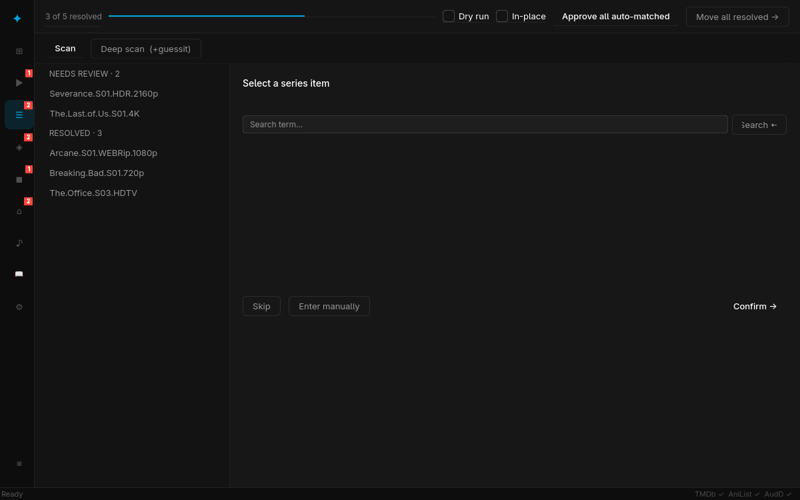</td>
    <td>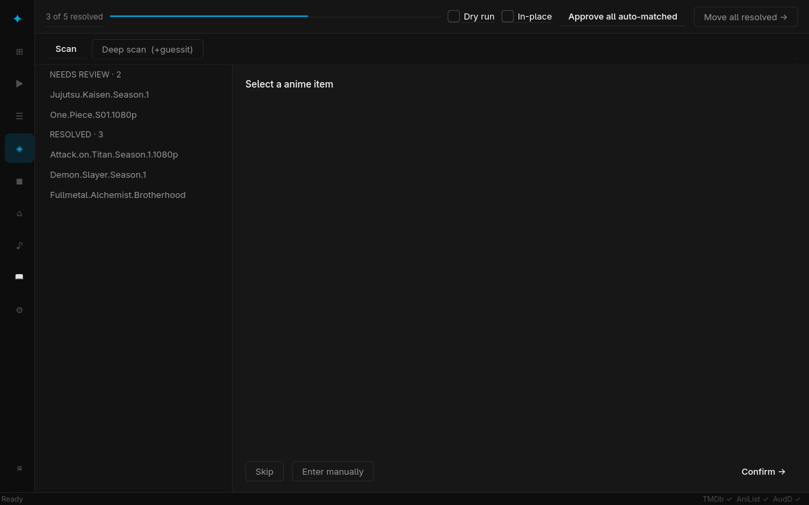</td>
  </tr>
  <tr>
    <td align="center"><b>Anime Films</b></td>
    <td align="center"><b>Web Series</b></td>
  </tr>
  <tr>
    <td>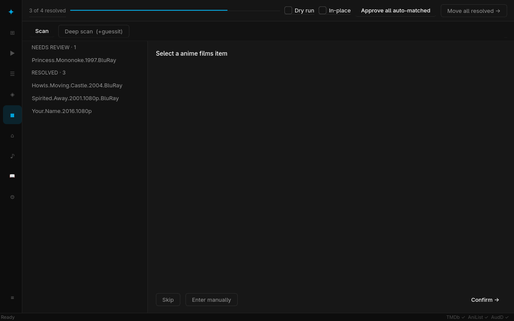</td>
    <td>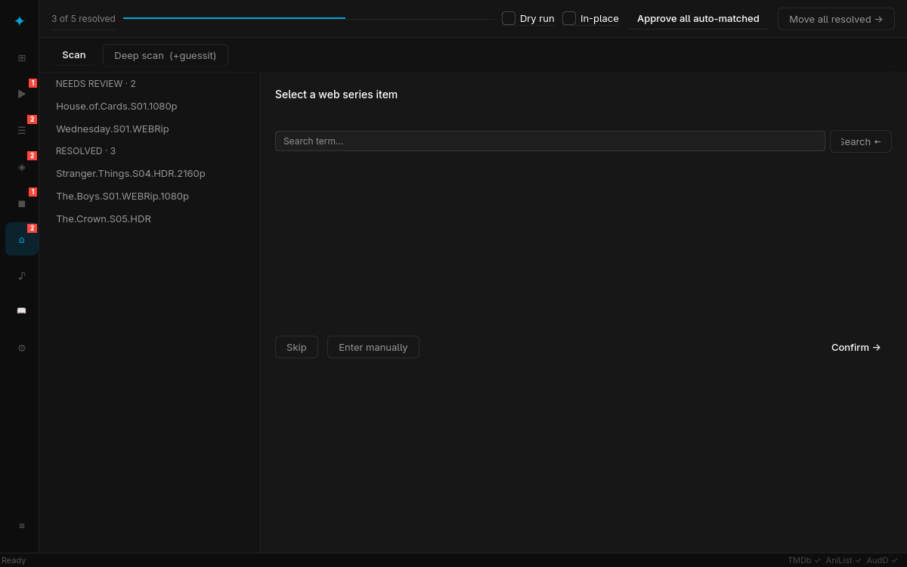</td>
  </tr>
</table>

### Music & Books

<table>
  <tr>
    <td align="center"><b>Music Library</b></td>
    <td align="center"><b>Books Library</b></td>
  </tr>
  <tr>
    <td>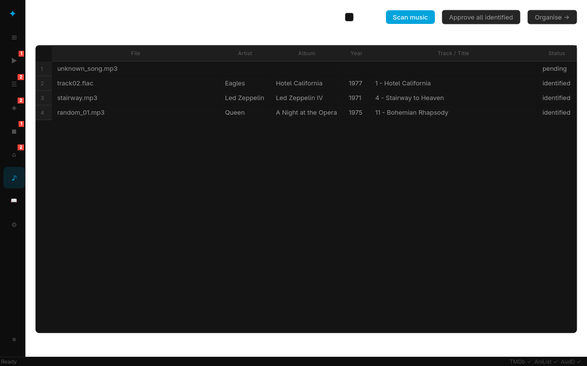</td>
    <td>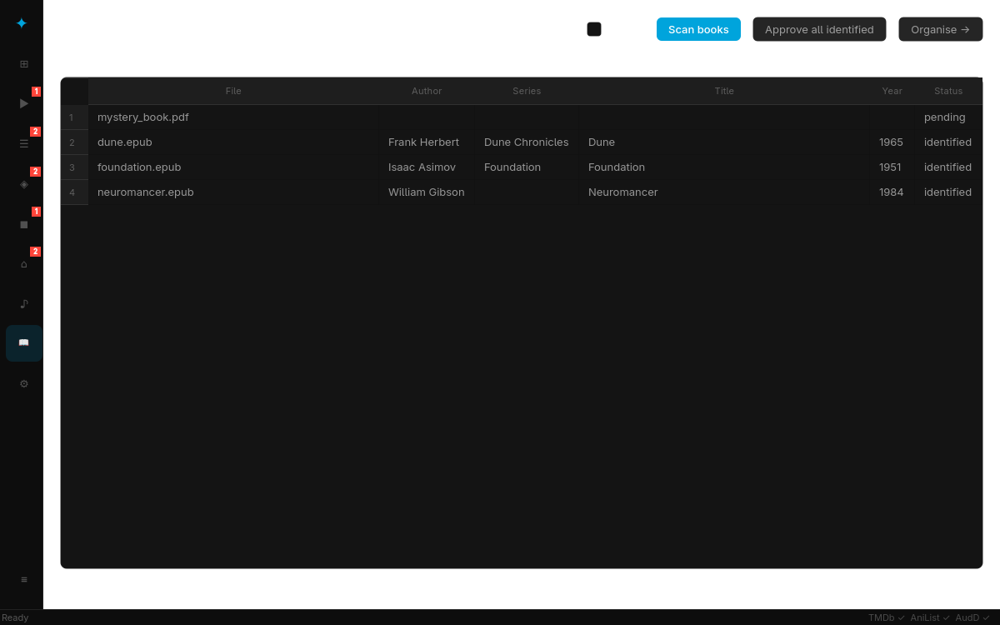</td>
  </tr>
</table>

### Settings & Log

<table>
  <tr>
    <td align="center"><b>Settings — API Keys</b></td>
    <td align="center"><b>Activity log</b></td>
  </tr>
  <tr>
    <td>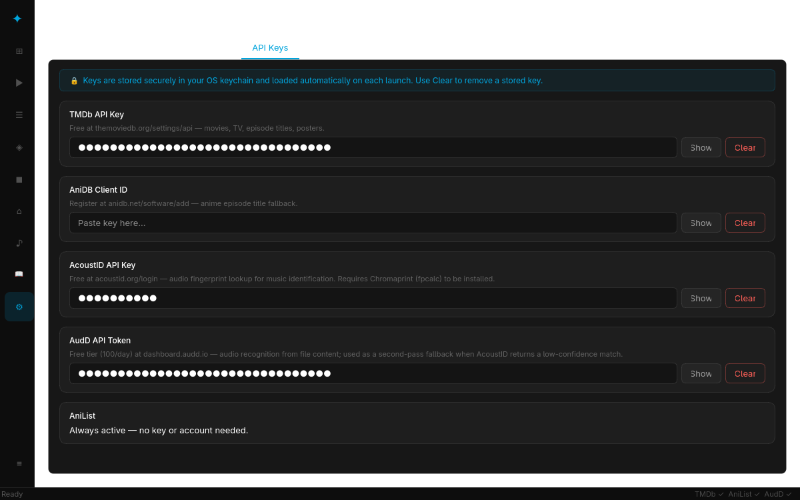</td>
    <td>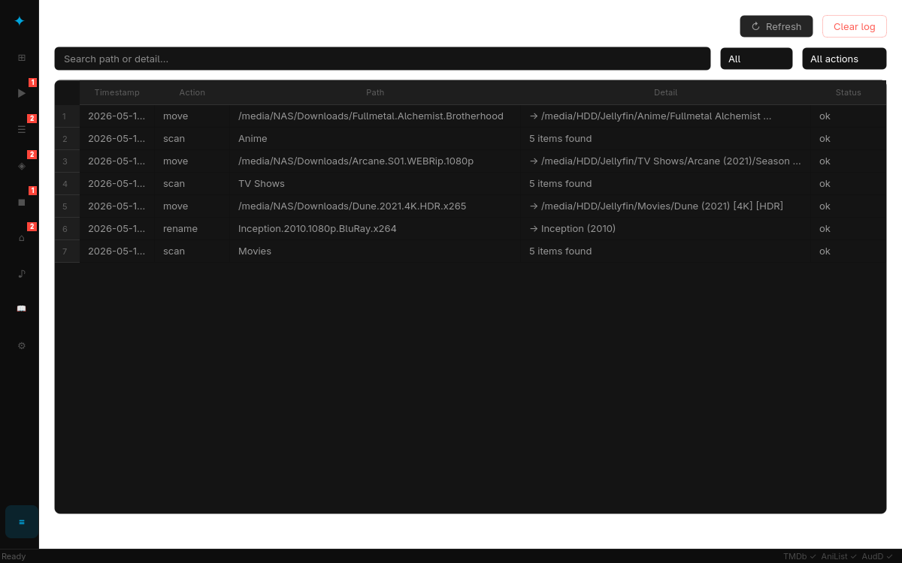</td>
  </tr>
</table>

---

## What it does

Orion turns messy media folders into the exact structure Jellyfin (and other servers) expect:

```
Movies/
  Inception (2010)/
    Inception (2010) [1080p] [BluRay].mkv

TV Shows/
  Breaking Bad (2008)/
    Season 01/
      Breaking Bad (2008) - S01E01 - Pilot.mkv

Anime/
  Attack on Titan (2013)/
    Season 01/
      Attack on Titan (2013) - S01E01 - To You, in 2000 Years.mkv

Web Series/
  The Boys (2019)/
    Season 01/
      The Boys (2019) - S01E01 - The Name of the Game.mkv

Music/
  Queen/
    A Night at the Opera (1975)/
      11 - Bohemian Rhapsody.flac
  Eagles/
    Hotel California (1977)/
      01 - Hotel California.flac

Books/
  Frank Herbert/
    Dune Chronicles/
      Dune.epub
  Isaac Asimov/
    Foundation/
      Foundation.epub
```

It handles the full pipeline: **scan → identify → rename → move**, with poster previews, quality-tag control, audio fingerprinting, and book metadata lookups along the way.

---

## Features

### Video

Each media type gets its own dedicated panel with a full scan → identify → move workflow:

| Panel | Media type | API source |
|---|---|---|
| **Movies** | Feature films | TMDb movie search |
| **Series** | TV shows | TMDb TV search |
| **Anime** | Anime series & seasons | AniList + optional AniDB |
| **Anime Films** | Anime feature films | AniList + optional AniDB |
| **Web Series** | Streaming originals | TMDb TV search |

- **Guided first-launch wizard** — sources, categories, destinations, and API keys in one flow
- **Fast scan** — infers media type from folder names with regex heuristics; only items matching the current panel's type are loaded
- **Deep scan** — walks all video files, runs `guessit` on up to 50 filenames per folder for a consensus media-type; more accurate for ambiguously-named folders
- **Category suggestion bar** — new categories detected during a scan are buffered and shown in a non-blocking notification bar after the scan completes; all suggestions combined into one review dialog
- **API-powered renaming** — fetches candidates from the appropriate API for each panel; poster thumbnails shown inline
- **Batch auto-approve** — rate-limit-aware: fires parallel requests up to the safe API batch limit (TMDb: 20, AniList: 15, AniDB: 5), then switches to sequential for the remainder
- **Quality tag control** — choose which tags (`[1080p]`, `[HDR]`, `[BluRay]`…) to keep per file
- **Episode naming** — configurable `S{s:02d}E{e:02d}` pattern with episode titles fetched from API
- **Scan isolation** — each panel only clears and repopulates its own items; scanning Movies does not affect Series or Anime

### Music

Three-stage identification pipeline, from most to least accurate:

1. **Embedded tags** — reads ID3 / Vorbis / MP4 tags via `mutagen`; if all key fields are present, skips the API entirely
2. **Audio fingerprinting** — runs `fpcalc` (Chromaprint) on the file and submits the fingerprint to [AcoustID](https://acoustid.org); results are verified and expanded via MusicBrainz
3. **AudD recognition** — when AcoustID scores below the confidence threshold, the first 512 KB of the file is sent to [AudD.io](https://audd.io) for audio recognition; returns artist, album, and release date
4. **MusicBrainz text search** — last resort: searches by filename stem when neither fingerprinting nor AudD gives a confident match; also used as the first fallback when `fpcalc` is not installed

Additional details:

- **MusicBrainz metadata** — full artist, album, year, and track number fetched from the free MusicBrainz API (no key required); 1 req/s rate limit enforced class-wide
- **Jellyfin music layout** — organises into `Artist / Album (Year) / TrackNum - Title.ext`
- **Chromaprint install banner** — shows an in-panel warning with install instructions if `fpcalc` is not in PATH

### Books
- **Format support** — epub and PDF
- **Embedded metadata** — reads Dublin Core from epub via `ebooklib`; reads `/Title` and `/Author` fields from PDF via `pypdf`
- **Open Library lookup** — when embedded metadata is sparse, searches the free [Open Library API](https://openlibrary.org/developers/api) (no key required) by title/author
- **Series detection** — extracts series names from Open Library subject tags (e.g. "Dune Chronicles", "Foundation Series")
- **Layout** — organises into `Author / Series / Title.ext`; falls back to `Author / Title.ext` when no series is found

### Media server integration (Jellyfin / Emby)

Connect Orion to your running server in **Settings → Server** (URL + API key from *Dashboard → API Keys*):

- **Duplicate warning** — while identifying an item, Orion searches your server library and warns inline if it already exists, including its resolution (e.g. *"Already in your media server library: Inception (2010) · 4K"*) — before you waste a move on a worse copy
- **Auto library refresh** — after every successful move batch (video, music, or books), Orion triggers a server library scan so new media appears immediately; toggleable in Settings
- **Episode Gaps panel** — loads every series from your server library and diffs its episodes against the full TMDb episode list, showing exactly which episodes are missing per season
- **Connection test** — one-click validation with server name and version readback
- Works with both **Jellyfin** and **Emby** (same API surface); the API key is stored in the OS keychain like all other keys

### NFO + artwork sidecars (opt-in)

Tick **Write NFO + artwork** in any panel to write metadata sidecars during moves, so servers pick up correct titles, plots, and provider IDs instantly without re-scraping — even offline:

| Media | Files written | Artwork source |
|---|---|---|
| Movies / Anime Films | `movie.nfo` + `poster.jpg` | TMDb (w500) / AniList cover |
| Series / Anime / Web Series | `tvshow.nfo` + `poster.jpg` | TMDb (w500) / AniList cover |
| Music | `artist.nfo`, `album.nfo` + `cover.jpg` | Cover Art Archive (via MusicBrainz release) |
| Books | `<Title>.jpg` | Open Library (by ISBN) |

- NFOs include title, year, plot, and a `<uniqueid>` provider ID (TMDb/AniList) in Kodi/Jellyfin-compatible XML
- Existing NFO and image files are **never overwritten**
- Off by default; the checkbox state is remembered per panel
- Music/book artwork downloads run in the background after the move so the UI never blocks on the MusicBrainz rate limit

### Organisation
- **Same-drive fast moves** — detects same filesystem via `os.stat().st_dev` (correct on Linux multi-mount setups); falls back to `shutil.move` across drives
- **In-place organisation** — "In-place" checkbox reorganises folders *within* the source folder rather than moving them to a new destination; useful when your source is already on the right drive
- **Dry run** — "Dry run" checkbox shows a preview table of every planned Source → Destination path *without touching any files*; uncheck to execute for real

### App
- **OS keychain API keys** — stored in Windows Credential Manager / macOS Keychain / Linux Secret Service; never written to plain-text files
- **Scan abort** — Stop button cancels a running scan cleanly mid-walk
- **System tray** — minimizes to tray, shows progress notifications on completion
- **Activity log** — full history of every rename and move
- **Cross-platform** — Windows, macOS, and Linux

---

## Requirements

| Dependency | Min version | Purpose |
|---|---|---|
| Python | 3.11 | Runtime |
| PyQt6 | 6.7.0 | Desktop GUI |
| requests | 2.32.0 | API HTTP calls |
| guessit | 3.8.0 | Video filename parsing |
| Pillow | 10.3.0 | Poster thumbnail rendering |
| keyring | 25.0.0 | OS keychain storage for API keys |
| mutagen | 1.47.0 | Audio tag reading (music) |
| ebooklib | 0.18 | epub metadata reading |
| pypdf | 4.0.0 | PDF metadata reading |

**Optional system dependency (music fingerprinting):**

```bash
# Arch / CachyOS
sudo pacman -S chromaprint

# Ubuntu / Debian
sudo apt install libchromaprint-tools

# macOS
brew install chromaprint
```

Without `fpcalc`, Orion falls back to AudD recognition then MusicBrainz text search — identification still works but is less accurate for files with no embedded tags.

---

## Installation

### From source (all platforms)

```bash
git clone https://github.com/Varun-SV/Orion.git
cd Orion
pip install -r requirements.txt
python main.py
```

### Standalone executable (Windows)

```bash
pip install pyinstaller
pyinstaller build.spec
# Output → dist/Orion/Orion.exe
```

---

## First launch

A setup wizard runs automatically the first time you open Orion:

| Step | What you do |
|---|---|
| 1 — Welcome | Read the intro, click **Get Started** |
| 2 — Sources | Browse to your unorganized media folders; Orion pre-scans and suggests categories |
| 3 — Categories | Review detected categories — adjust names, media types, API preference, and destination subfolders |
| 4 — Destinations | Pick the root folder(s) where organized media will land |
| 5 — API keys | Paste your TMDb key, AniDB client ID, AcoustID key, and/or AudD token (all optional) |
| 6 — Done | Open the dashboard |

---

## API keys

| Service | Used for | Key required? | How to get one |
|---|---|---|---|
| **TMDb** | Movies, TV shows, Web Series, episode titles, posters | Recommended | [themoviedb.org/settings/api](https://www.themoviedb.org/settings/api) — free account |
| **AniList** | Anime search | No | Always active, no key needed |
| **AniDB** | Anime episode title fallback | Optional | Register a client at [anidb.net/software/add](https://anidb.net/software/add) |
| **MusicBrainz** | Music metadata | No | Always active, no key needed |
| **AudD** | Music recognition (second-pass fallback) | Optional | Free 100 req/day at [dashboard.audd.io](https://dashboard.audd.io) |
| **Open Library** | Book metadata | No | Always active, no key needed |
| **AcoustID** | Audio fingerprint lookup | Optional | Free at [acoustid.org/login](https://acoustid.org/login) — enables fingerprint-based music ID |
| **Jellyfin / Emby** | Duplicate check, library refresh, episode gaps | Optional | Your server's *Dashboard → API Keys*; configure in Settings → Server |

Keys are stored in the **OS keychain** and loaded automatically on every launch:

| OS | Backend |
|---|---|
| Windows | Windows Credential Manager |
| macOS | Keychain Services |
| Linux | Secret Service API (GNOME Keyring, KDE Wallet) |

Use **Settings → API Keys → Clear** to remove a stored key. If no keyring backend is available, Orion falls back to session-only storage and displays a warning banner.

---

## Usage walkthrough

### Video: Scan → Identify → Move

Each video panel (Movies, Series, Anime, Anime Films, Web Series) is independent — pick the panel that matches your files:

1. **Click the panel** in the sidebar (e.g. **▶ Movies** or **☰ Series**).

2. **Scan** — click **Scan now** (fast) or **Deep scan** (runs `guessit` on video filenames for better accuracy on ambiguously-named folders). Only items matching this panel's media type are loaded.

3. **Identify** — Orion fetches API candidates for each item (TMDb for movies/series/web-series, AniList/AniDB for anime). Pick the correct match from the poster cards, or click **Approve all auto-matched** to let Orion resolve single-result items automatically.

4. **Move** — once choices are confirmed, click **Move all resolved →**. Orion builds the destination path from your category's configured subfolder, prefers same-drive destinations for instant moves, and logs every action.

   - **Dry run**: tick the checkbox first to see a Source → Destination preview table without moving anything.
   - **In-place**: tick this instead to rename folders *inside* the source folder, without moving to a separate destination.

### Music

1. Click **♪** in the sidebar to open the Music Library panel.
2. Click **Scan music** — Orion walks source folders for audio files. For each file it reads embedded tags, then fingerprints via AcoustID, then tries AudD recognition, then falls back to MusicBrainz text search.
3. Review the table: files with green **identified** status have good metadata. Yellow **pending** means no stage found a confident match — double-click to edit metadata manually.
4. Click **Approve all identified**, then **Organise →** to move files into `Artist / Album (Year) / TrackNum - Title.ext`.

### Books

1. Click **📖** in the sidebar to open the Books Library panel.
2. Click **Scan books** — Orion walks source folders for `.epub` and `.pdf` files, reads embedded metadata, and queries Open Library for anything unidentified.
3. Review identified items. Double-click a row to edit Title, Author, Series, or Year manually.
4. Click **Approve all identified**, then **Organise →** to move files into `Author / Series / Title.ext`.

### Dashboard

Live overview: total items, pending count, organised count, issues, drive usage bars, source folders, categories, and recent activity.

---

## Configuration & data storage

Orion stores all state in a single directory:

| OS | Location |
|---|---|
| Windows | `%APPDATA%\Orion\` |
| macOS / Linux | `~/Orion/` |

| File | Contents |
|---|---|
| `organizer.db` | SQLite database — sources, categories, scan items, rename choices, music items, book items, activity log |
| `prefs.json` | UI preferences — window geometry, last active panel |

> **First launch detection**: Orion checks whether `organizer.db` exists. Deleting this file resets the app to first-launch state (the wizard re-runs). Your media files are never touched by a reset.

---

## Naming conventions

### Video (Jellyfin)

| Media type | Folder format | File format |
|---|---|---|
| Movie | `Title (Year)/` | `Title (Year) [tags].ext` |
| TV series | `Series (Year)/Season NN/` | `Series (Year) - SXXEXX - Episode Title.ext` |
| Anime | `Series (Year)/Season NN/` | `Series (Year) - SXXEXX - Episode Title.ext` |
| Web Series | `Series (Year)/Season NN/` | `Series (Year) - SXXEXX - Episode Title.ext` |

Quality tags (e.g. `[1080p]`, `[HDR10]`) are optional bracket suffixes you control per file in each panel.

### Music (Jellyfin)

```
Artist/
  Album (Year)/
    01 - Track Title.ext
    02 - Track Title.ext
```

### Books

```
Author/
  Series Name/
    Book Title.epub
Author/
  Book Title.pdf        ← no series subfolder when series is unknown
```

---

## Project structure

```
Orion/
├── main.py                    # Entry point — initializes app, DB, wizard or main window
├── core/
│   ├── config.py              # App config, prefs, OS keychain API key storage
│   ├── database.py            # SQLite schema and all query helpers
│   ├── scanner.py             # Source folder walking + category detection heuristics
│   ├── renamer.py             # API candidate fetch + rename choice persistence
│   ├── file_namer.py          # Jellyfin filename formatting + quality tag extraction
│   ├── mover.py               # File/folder move (same-drive, cross-drive, in-place, preview)
│   ├── nfo_writer.py          # Kodi/Jellyfin NFO sidecar generation (movie/tvshow/artist/album)
│   ├── artwork.py             # poster.jpg / cover.jpg downloads (TMDb, AniList, CAA, Open Library)
│   ├── server_link.py         # Jellyfin/Emby client from saved settings + auto-refresh hook
│   └── utils.py               # Filename sanitization, video/subtitle extension sets
├── api/
│   ├── tmdb.py                # TMDb REST client — movies, TV shows, posters, episode titles
│   ├── anilist.py             # AniList GraphQL client — anime search
│   ├── anidb.py               # AniDB HTTP client — anime episode title fallback
│   ├── jellyfin.py            # Jellyfin/Emby client — search, refresh, series episodes
│   ├── musicbrainz.py         # MusicBrainz client — music search + recording fetch (free)
│   ├── acoustid.py            # AcoustID client — fpcalc fingerprint → MusicBrainz ID
│   ├── audd.py                # AudD.io client — audio recognition by file upload
│   └── openlibrary.py         # Open Library client — book search (free)
├── ui/
│   ├── main_window.py         # Sidebar navigation + stacked panels + system tray
│   ├── wizard.py              # First-launch setup wizard (6 steps)
│   ├── dashboard.py           # Stats cards, drive bars, sources, categories, activity
│   ├── video_panel.py         # Reusable per-type panel: scan + identify + dry run + move
│   ├── music_panel.py         # Music scan, tag review, fingerprint identification, organise
│   ├── books_panel.py         # Book scan, metadata review, Open Library lookup, organise
│   ├── gaps_panel.py          # Episode Gaps — server library vs TMDb episode diff
│   ├── settings_panel.py      # Edit sources, categories, destinations, API keys, server
│   ├── log_panel.py           # Activity log viewer
│   └── styles.py              # Dark Jellyfin-inspired QSS theme
├── workers/
│   ├── scan_worker.py         # QThread: runs Scanner without blocking the UI
│   ├── api_worker.py          # QThread: video API lookups with progress signals
│   ├── move_worker.py         # QThread: file moves + optional NFO/artwork sidecars
│   ├── batch_approve_worker.py# QThread: parallel + sequential auto-approval
│   ├── music_scan_worker.py   # QThread: audio tag reading + fingerprinting + AudD
│   ├── book_scan_worker.py    # QThread: epub/PDF metadata + Open Library lookup
│   └── server_worker.py       # QThreads: server test, dup check, series list, gap analysis
├── build.spec                 # PyInstaller build configuration
├── requirements.txt
└── LICENSE
```

---

## Known limitations (beta)

- **AniDB requires client registration** — unregistered clients are aggressively rate-limited. Register at [anidb.net/software/add](https://anidb.net/software/add) and enter your client ID in Settings → API Keys.
- **AcoustID key optional but recommended** — without a personal key the fallback test key is shared and heavily rate-limited. Register free at [acoustid.org/login](https://acoustid.org/login).
- **AudD free tier** — the free AudD plan allows 100 recognition requests per day. For large music libraries, consider adding a paid AudD token or ensuring `fpcalc` is installed so AcoustID is tried first.
- **Linux without a keyring daemon** — headless or minimal Linux installs may have no Secret Service provider. Install GNOME Keyring (`gnome-keyring`) or KWallet and ensure a D-Bus session is running; without one, keys fall back to session-only.
- **No undo** — moves are immediate. Use **Dry run** to preview before committing.
- **No episode-level NFOs yet** — Orion writes `movie.nfo`/`tvshow.nfo` per title; per-episode NFOs (plot + air date for every file) would need one TMDb call per episode and are planned as a follow-up.
- **Music covers need a MusicBrainz match** — Cover Art Archive lookups go through the recording's MBID, so files identified only from embedded tags (no MBID) get NFOs but no `cover.jpg`.
- **Deep scan on large libraries is slower** — `guessit` is run on up to 50 video filenames per folder; on a source with hundreds of folders this adds a few seconds per folder compared to the fast scan.
- **Book hosting platform** — the current naming convention (`Author/Series/Title.ext`) is compatible with Calibre, Kavita, and most OPDS-based book servers. The layout can be adjusted in a future release once a target server is confirmed.

---

## Contributing

Pull requests are welcome. For significant changes please open an issue first to discuss what you'd like to change.

---

## License

[MIT](LICENSE) — Copyright © 2026 Varun S V
