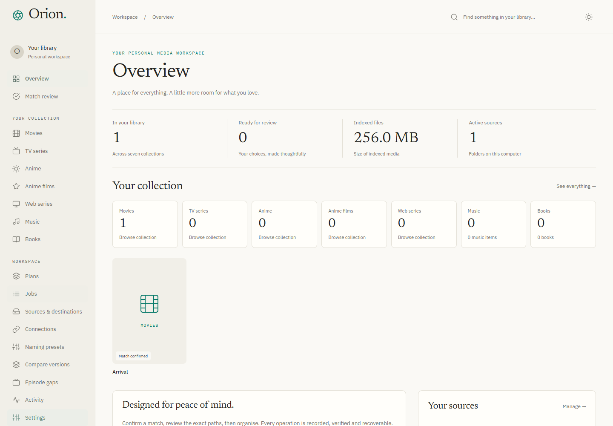

# Orion

A calm workspace for your media. Organise movies, TV series, anime, anime films, web series, music and books with explicit metadata review, previews and recoverable file operations.



Orion uses a React/TypeScript interface with a local FastAPI/Python engine and SQLite. The installed Windows bundle includes its own Python runtime; it needs no Node or Qt. Media stays on your PC or accessible NAS folders. Metadata providers and optional Jellyfin/Emby connections are configured separately.

## What you can do

- Scan sources, review provider candidates or correct metadata manually, and search across all seven collections.
- Preview exact file paths with versioned naming presets, conflict choices and optional NFO/artwork output before approving any move.
- Follow persistent jobs, cancel or retry them, inspect interrupted operations and preview guarded undo. Transfers verify bytes and never replace existing files.
- Compare editions and on-demand SHA-256 content, watch stable arrivals with optional identification, and export actual job outcomes as CSV/JSON.
- Connect Jellyfin or Emby with an explicit user, review duplicate hints, refresh after successful organisation and inspect episode gaps against a confirmed TMDb mapping. Unavailable catalogues are shown as unavailable.
- Choose Ivory, Clay or Night, use the responsive layout and keyboard-accessible review dialogs, and keep reduced-motion preferences.

The [public project site](https://varun-sv.github.io/Orion/) has a clearly labelled fixture demo and installation/recovery guidance. Its first deployment awaits this PR's user-controlled merge to main; the production app never substitutes demo jobs or counts.

## Run from source

Use Python 3.11 or 3.12 and Node 24 for building. From this repository:

```powershell
python -m venv .venv
.venv\Scripts\python -m pip install --require-hashes -r requirements-web.lock
npm --prefix frontend ci
npm --prefix frontend run build
.venv\Scripts\python -m orion --port 0
```

The launcher opens the local browser when ready. Connect an accessible source and destination, scan, confirm a match, then create and revalidate a preview. Renaming in place is available for music and books. An occupied explicit port produces an error without stopping another process.

For an isolated test or separate workspace:

```powershell
.venv\Scripts\python -m orion --data-dir "D:\OrionData" --port 0 --no-browser
.venv\Scripts\python -m orion stop --data-dir "D:\OrionData"
```

The default Windows data directory is `%APPDATA%\Orion`. Back up the whole data directory before upgrades. Legacy database migration makes a consistent snapshot before changing the schema and imports unambiguous decisions. Never run the old and new app against the same data concurrently; later legacy writes are not reimported. [Data, migration and recovery](docs/runtime.md) explains restoration.

## Windows standalone build

```powershell
.venv\Scripts\python -m pip install --require-hashes -r requirements-dev.lock
.venv\Scripts\python scripts/build_package.py
.venv\Scripts\python scripts/smoke_package.py --executable dist/Orion/Orion.exe
```

Keep the entire `dist/Orion` directory, including `_internal`, when copying the app. Start `Orion.exe`. Windows builds are unsigned. Native Linux/macOS installers have not been verified; source operation remains available. [Packaging, CI, releases and Pages](docs/github-delivery.md) provides archive/checksum commands and release safeguards.

## Providers and connections

TMDb, AniList, AniDB, MusicBrainz and Open Library supply metadata. AcoustID requires separately installed `fpcalc` and explicit fingerprint consent; AudD sample upload has a separate explicit consent switch. Keys are write-only and use the OS keychain; unavailable secure storage requires an explicit session-only choice. [Integration setup](docs/integrations.md) covers server API URLs, user selection, cover/NFO output and retry behavior. Plex is not implemented.

## Development and validation

```powershell
.venv\Scripts\python -m pip install --require-hashes -r requirements-dev.lock
.venv\Scripts\python -m pytest -q
npm --prefix frontend run check
node scripts/browser_qa.mjs
npm --prefix site ci
npm --prefix site run build
npm --prefix site test
```

Browser QA uses isolated generated fixtures with the real backend. On this PC it uses installed Edge; CI installs Playwright Chromium. See the [validation report](docs/validation/2026-10-09-connected-runtime.md) for observed results and limits. Live authenticated providers/media servers require your own configuration. No memory or CPU superiority is claimed.

The original PyQt interface remains available as a migration fallback: install `requirements.txt` in a separate environment and run `python main.py`. Its previous documentation is [preserved here](docs/legacy-desktop.md); the modern requirements and bundle exclude Qt.

[MIT licence](LICENSE). Bundled frontend fonts/icons retain their [licences](frontend/licenses). The [approved design](docs/superpowers/specs/2026-10-08-orion-modernisation-design.md) records scope and the goals preserved from closed PRs #1 and #2.